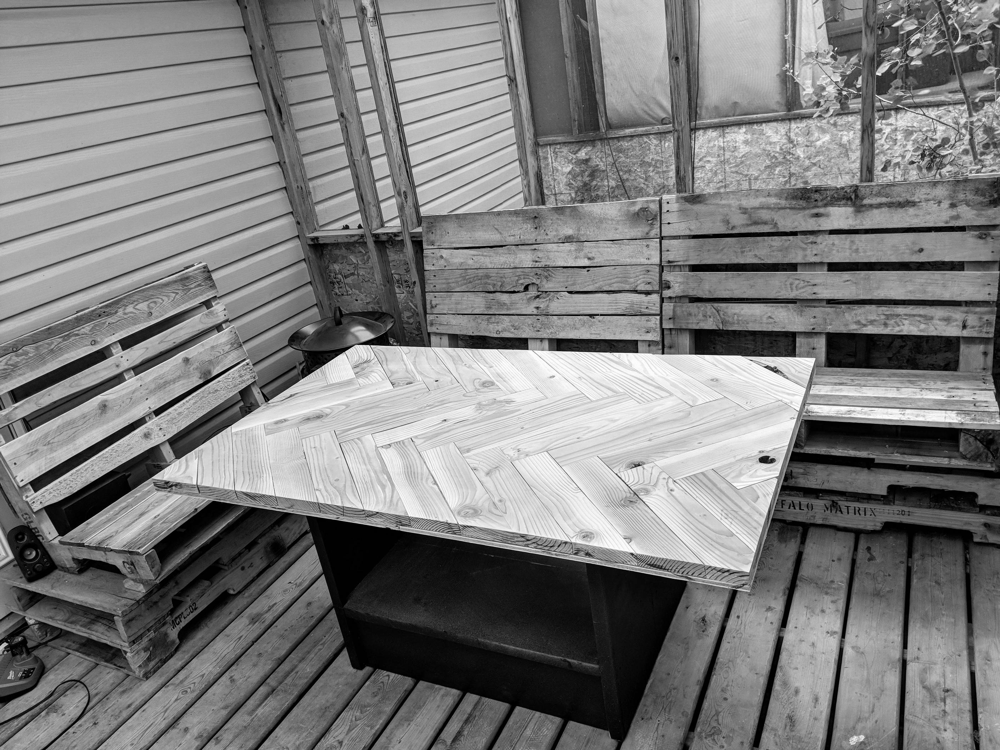
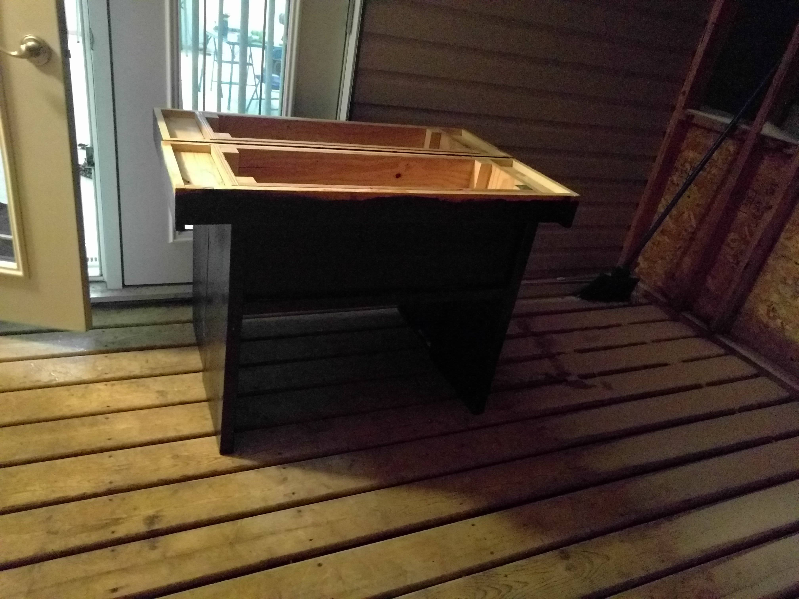
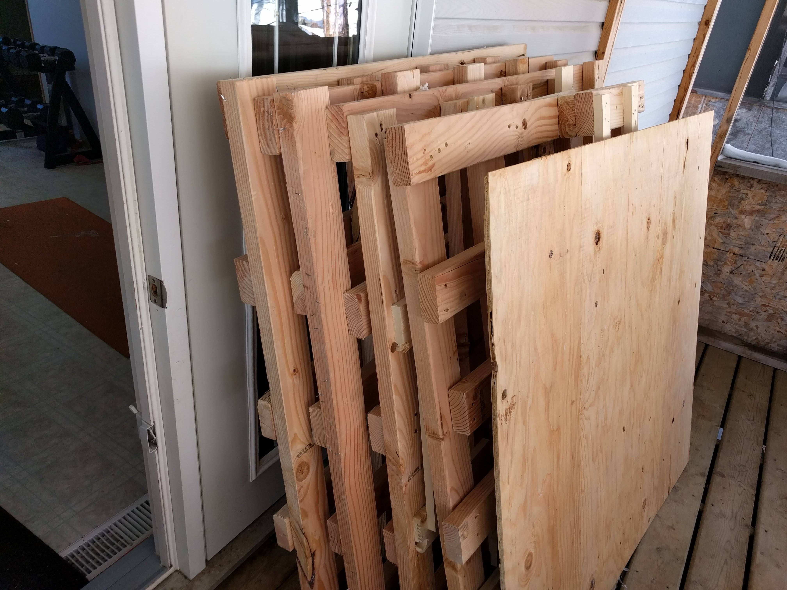
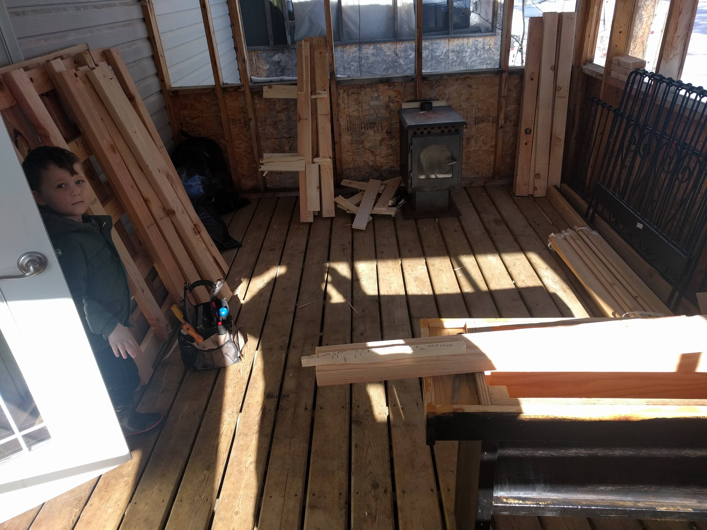
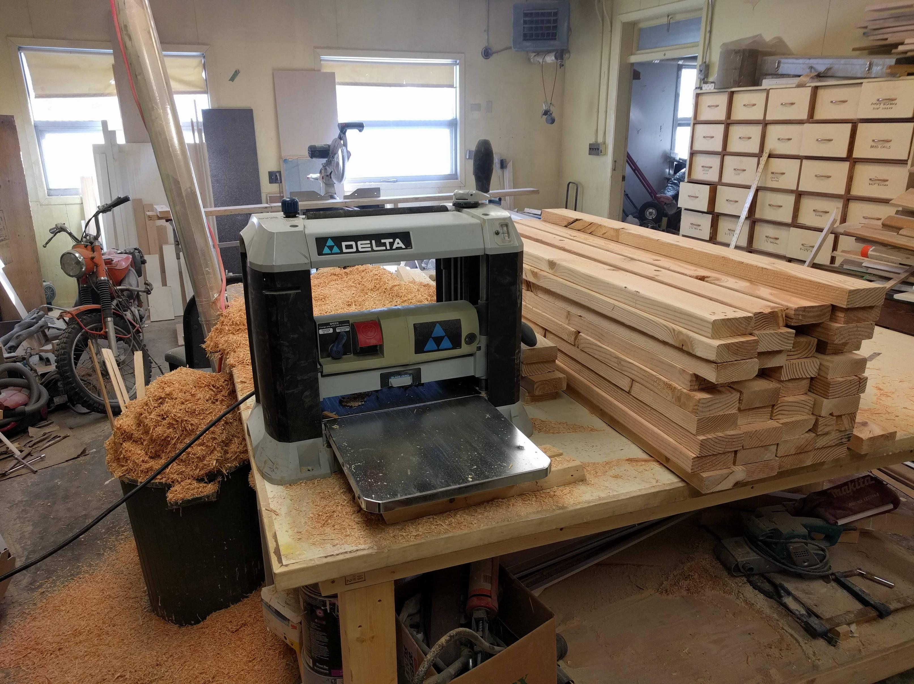
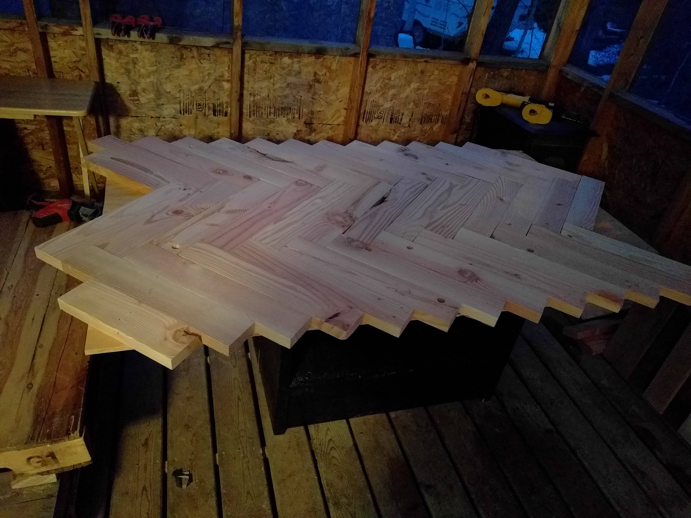
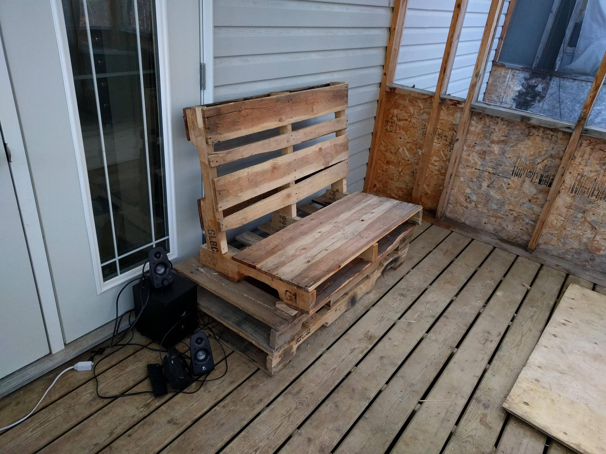
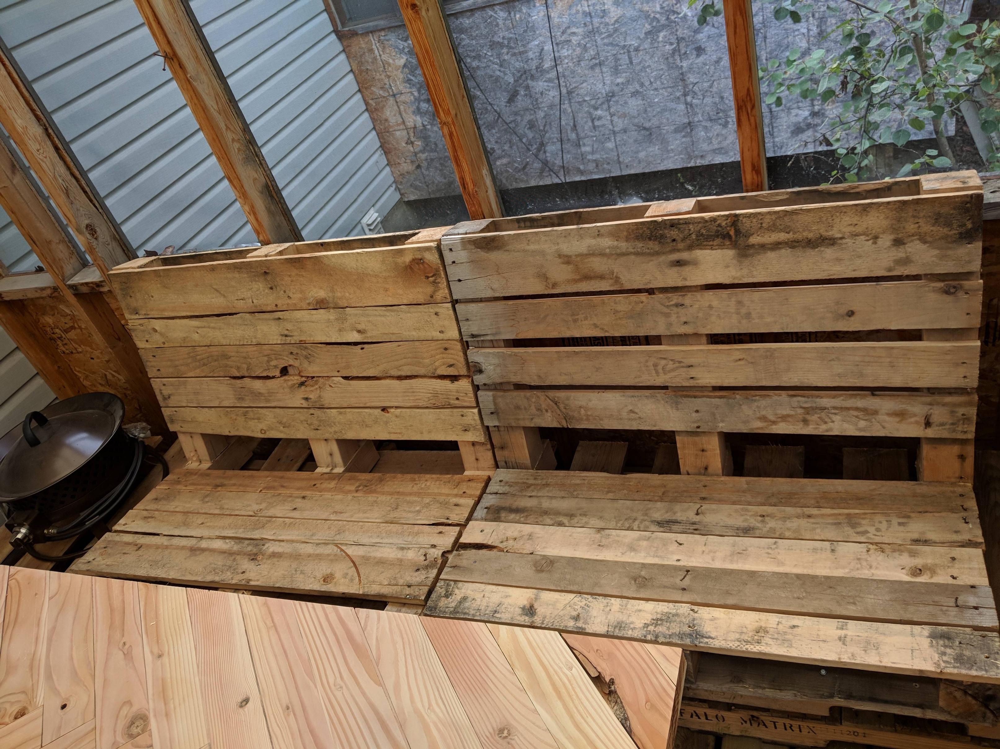
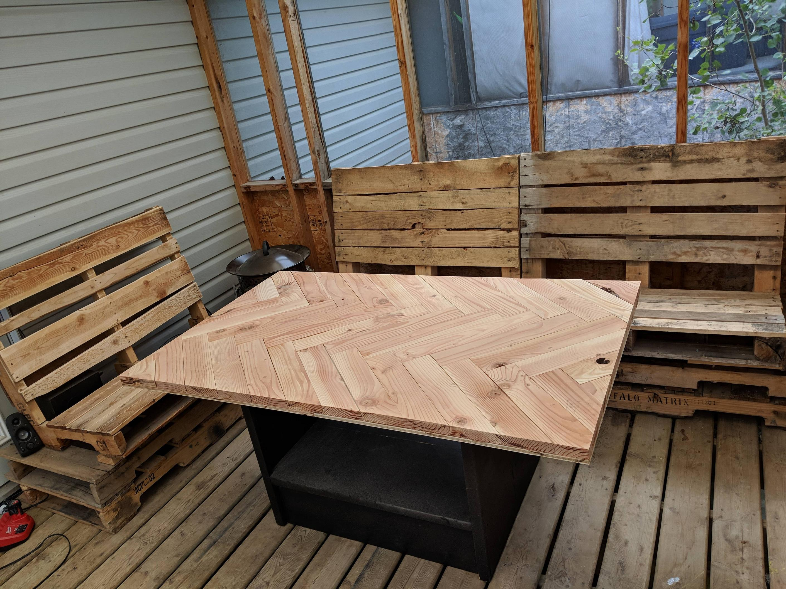

# Table Build Log

[back](../README.md)

> Some people ask, "Why use reclaimed, crappy wood?" And I realise as I do this... there's a real beauty to it. It's taking a scar, and turning it into a thing of beauty.

## The Beginning

I was at work, minding my own business, well. Cleaning out an old business, actually.

Now, tell me that doesn't look like a table. Work got busy again, and the idea of making a table stagnated for a few months. 

## More Wood

Some nice pallets came in, Douglas Fir and in decent shape.

So I got to work breaking them down, planing them, finding a pattern that looked great, as a tabletop.

## Sit Down And Relax

I needed some form of chair for my deck. And there were copious pallets around, so I slapped together a few pallet chairs

## Start To Work the Tabletop

## But, Sadly

I sold the table as we had to move before I could finish the top.

All in all, this was a very fun project that I would do again in a heartbeat. I learned much, and would definitely do things differently next time:
 - Edge plane the boards so they fit flush together
 - Make sure to measure all dimensions of the boards! 
 - Epoxy coat the top and keep it this time

Questions? Comments? Email me <michaelmisch1985@gmail.com>
© 2018 Michael Misch