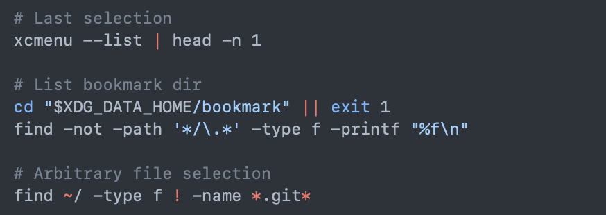

### Preface 

I want weird things. Some of them don't make sense other than, "Nice to have". It's a nice problem to have, to be able to consider things from the lense of an enthusiast. But it can be hard to relay the reason I want something, the _why_ of it, to people who have no or little enthusiasm for what I like to try to achieve.

#### Ergonomics

I was a construction worker for many years, and before that I was in industry that damaged my neck, my back, my... hands and my wrists (sorry Khia). I've been dealing with the fallout as a computer programmer and musician, when it now hurts to follow my passions! So I have little choice but to consider ergonomics. Sometimes to make it work, there's a lot of compromise.

From this, I'm driven towards keyboard control, as it means I don't have to move my shoulders in awkward ways to manipulate mice. As well, I'm driven to well designed work stations that match a task well, such as a drafting-style setup for drafting work, versus a workbench-style setup for electronics tinkering.

#### Neurodivergence

Some of the wanting weird things, comes from embracing how I interact and view the world, how I work - which can be different than for a neurotypcial person. In my case, I can be thrown off task with such ease it's maddening. I want to be able to pull up my specific task, as I left it, as it again becomes actionable.

I want to walk up to a computer, type a few words, and let myself fall into the world I am targetting; or walk up to a computer, type a few words, and walk away lost in thought, over to another area, another setup. With browser tab groups, you do actually get a bit of that! But that requires cloud tabs, if you want it between devices. It requires everything living in a browser, which still is a compromise. It's highly mouse-centric, keyboard controls can be tagged on, but they break all the time, it's an uphill battle, truly.

#### Tinkerish Delights

I wrote a wm to match how I generally like my windows to be laid out, somewhat similar to dwm's layout schema, but automated because I don't actually like manipulating windows if I'm doing the same thing in 99% of cases; I can reduce that to an algorithm, which I did in my [bin packing post](https://halfwit.github.io/2017/09/21/binpacking.html). It really worked with me, it just stayed out of my way. I really miss it.

I wrote a Spotlight/launcher that works with something called a plumber that takes a resource string and launches the right program with a very high degree of control, like xdg-open on steroids. I miss that on macOS, I really really miss that. I miss a lot of the bespoke tools I built to match needs and wants, and when I've tried to port them or make them work, it's always been somewhat of a compromise.

#### ...buuuuut

I live in the world and have to work, I can't lean into my ideals so fully that I can use whatever operating system I desire, for example. I have macOS on a MacBook Air M1 because it allows me a bunch of nice things that I like, but more importantly I need access to Xcode for work and to make things I care about a reality. I don't have a server to virtualize macOS yet, and to be very clear I love this thing as it is as a piece of hardware. It's light, runs cool, uses little power, looks great, and lets me communicate with loved ones with slightly less headache than I'm used to. 

I live in the world and have partners/kids that factor in to what I can do. I can't have a noisy server in the living room next to the ethernet ports. I need to be mindful of power consumption as the wiring in this house is... well, not great. I have to be mindful of my expenditures. So my solutions benefit from being affordable, power efficient, quiet, and compact.

### In A Hypothetical Setup

Some of this is just saving up for and buying, some of it is just work I have to do to get it set up. Some of it is already in place!

#### Peripherals

[Keyboards](https://halfwit.github.io/2017/05/08/keyboardblog.html) have been quite a journey for me, I started with 60% mechanical keyboards, I've gone through making my own by hand, I've learned different layouts, just about anything I can do to try to mitigate how my hands feel after putting in a days' work. Nowadays, it's easy to get a bluetooth keyboard that is purpose-made to lessen hand strain, with mouse emulation even! [So that's something I'm planning to get](https://github.com/GEIGEIGEIST/KLOR), and I intend to use much more keyboard control.

Since I have mouse emulation available on the keyboard, I think I can get away with just using touchpads. I don't mind them, but aside from that if I need precision I would like to get a pen + tablet set up. That precludes everything being digitized, and staying away from the current paper + pen solution I have now.

Audio peripherals are a wild and divisive topic, but I mostly just use headphones, and that's mostly sorted out. I have a nice pair of headphones that sit at my work desk, and bluetooth headphones outside of that.

#### Devices

What I want or need to enable my hypothetical setup

I have a MacBook Air M1, I have a Thinkpad x230 that runs 9front, and things like a Raspberry Pi 3. That's enough to do most of what I want, but I run into issues. I have too little storage for running VMs + Docker, like far too little space to work on more than one project at a time aside from work things. I feel the best way to address this, as well as afford many other niceties, is using a NAS. 

A NAS would give me space for Docker images, VMs/device emulators, a place for photos/videos which currently takes up too much of my space. I can use cloud storage and mitigate some of this, but that's slower, with edge cases where users have lost access to files because of glitches or account bans. Now from the above, I also want it to look nice, run on little power, and be quiet. So no spinning rust hard drives, NVME drives match those predicates much better.

For my needs, I'm thinking something like https://www.bhphotovideo.com/c/product/1193826-REG/istarusa_s_35ex_3_x_5_25_bay.html with these in the front https://global.icydock.com/product_305.html to hold m.2 drives. This would require many PCIe lanes, so something like an EPYC or newer Ryzen would be in order for a motherboard.

I could run VMs on the NAS, and likely will initially. But down the road I would love to get dedicated hardware, and I've been thinking of making use of something like a Lenovo Thinkcentre M Series, moving up from there if needed, as well as playing around with a HA cluster.

Finally, I would like to get a nice monitor to ensure my computer is correctly at eye level for my main setup, reduce eye strain, and increase my screen real estate. That's not too difficult to sort out, but it does come after the rest of it. 

#### Software Stack

I want to walk up to a computer, log in, and it's my world. My files, my programs, my everything. 
- explain how each piece plays together, but talk about plan9 specifics in potential solutions/where am I today 
- xserver, remote into "world" with files, have my pieces separate

### Potential Solutions

- talk about proxmox, vs code remote access, xserver stuff, what hardware will enable what piece

### Where Am I Today?

- talk about what plan9 gives, hwwm, what my hardware enables today