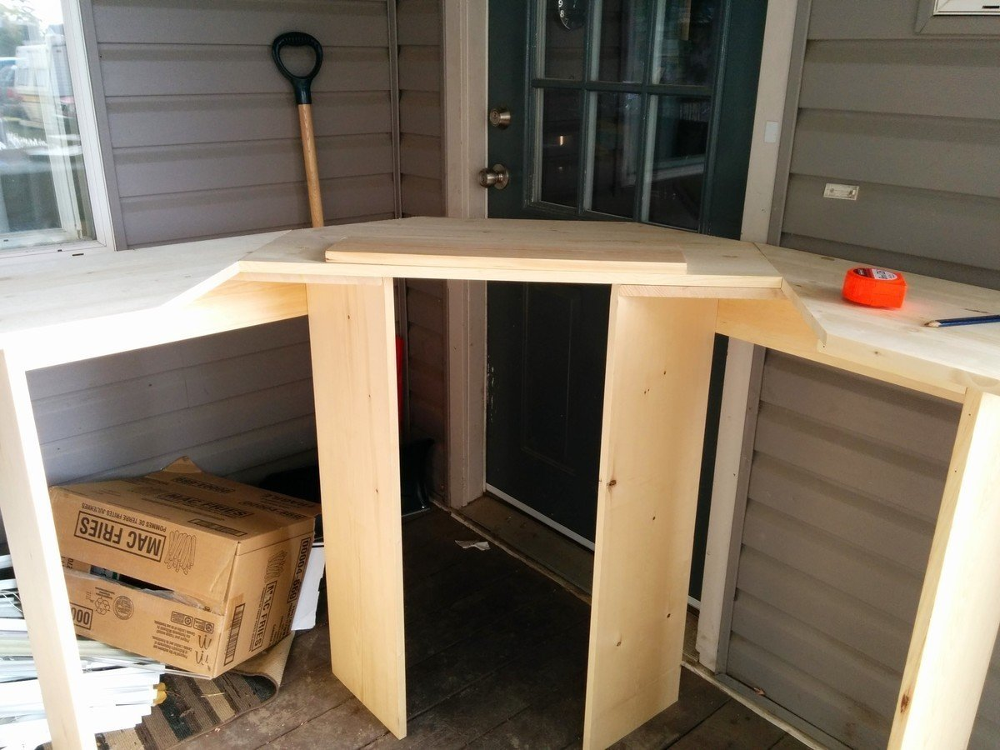
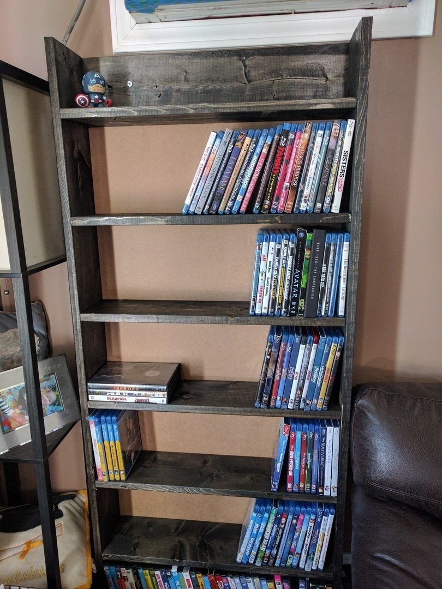
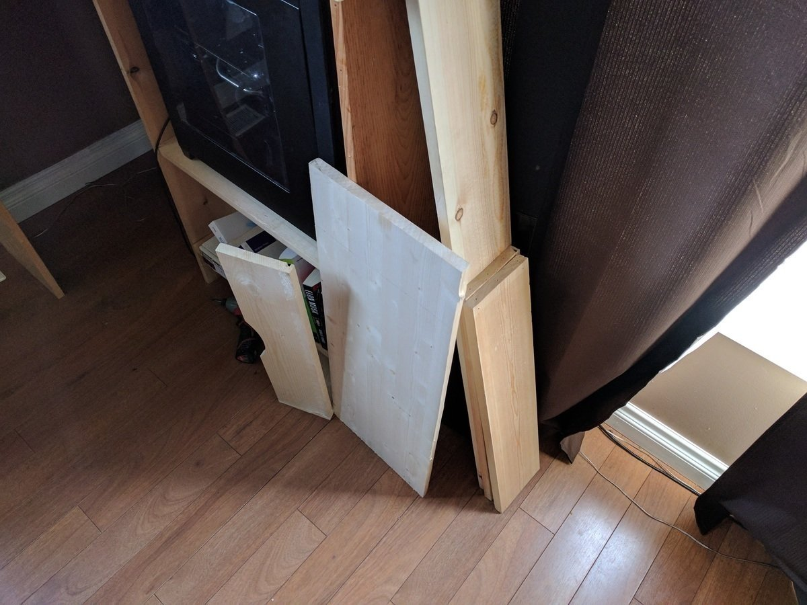
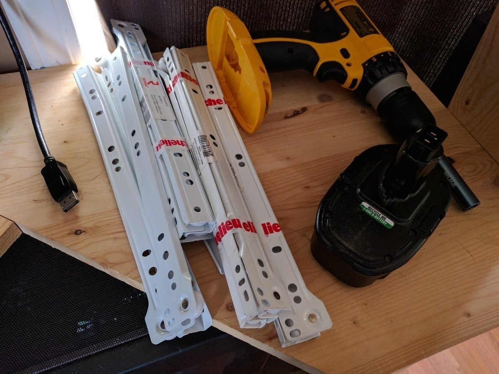
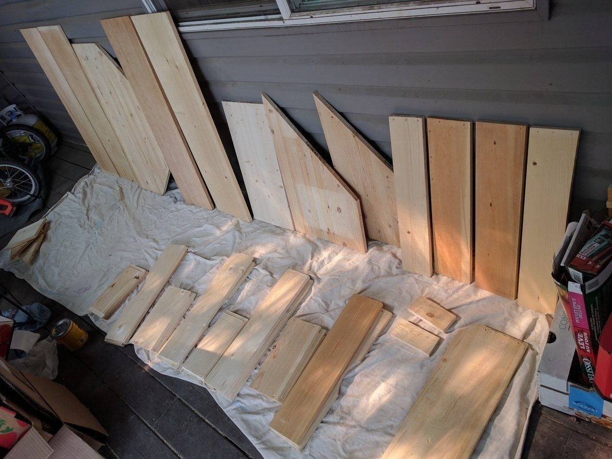
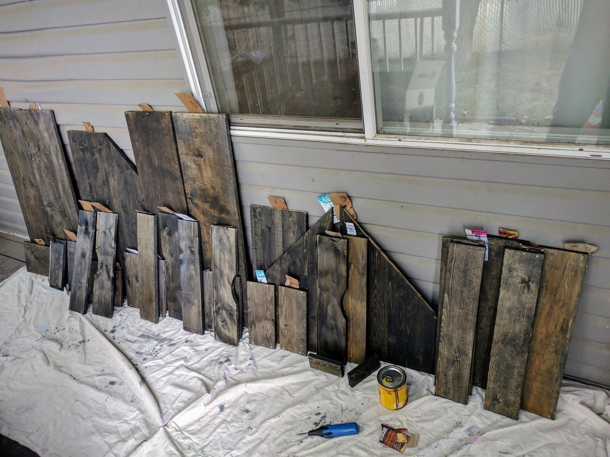
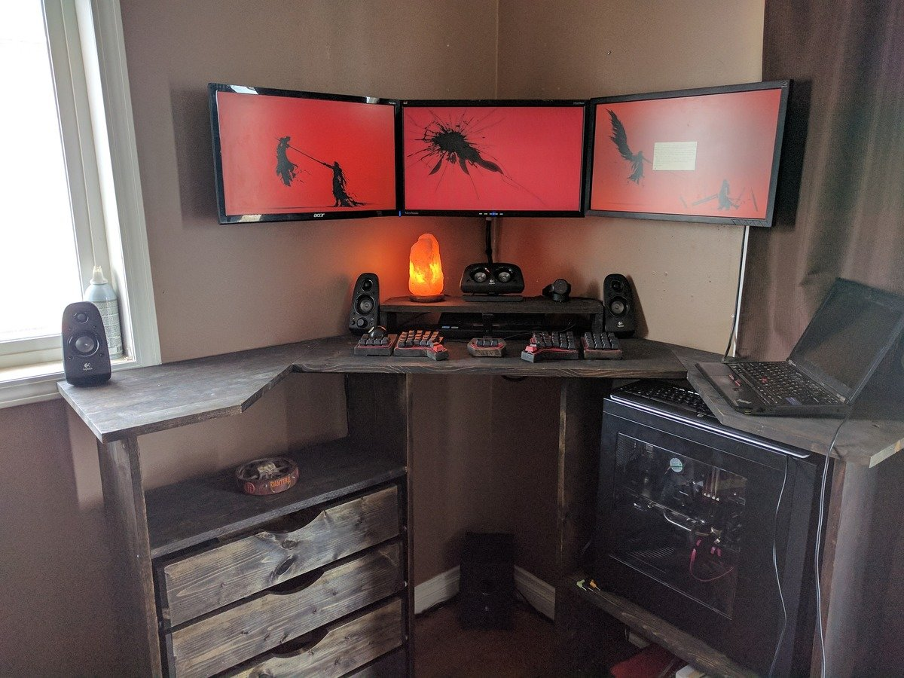

# Desk Build Log

## 2014

I had been reading all of the various literature about standing desks. It all seemed too good, why weren't these more popular?
Oh, right. That price tag. At the time, the sit-to-stand variants that I had found were > $1,000 CDN, which is well above anything I'd be willing to pay for a desk. (Which is funny, since all told this desk probably did cost me ~$300)
So it came down to either buying an existing standing-only desk, non of which I really liked, or designing something of my own to fit exactly in the space I had.

## It Started On Paper

I started with some dimensions, and some calculations of viewing distances from monitors, that ended up being wrong. (I've long since lost the drawings) I knew I wanted a corner desk, and to be (at the time) roughly 30" from my monitors. I had 52" from my wall to where the door opened, and in the spirit of symmetry I decided to have both wings of the corner desk extend out to that distance.
Then, I was measuring from the floor to a more-or-less ideal height; I went with 40.5" tall, and had a tray that I could adjust height-wise to meet exactly. 

## So, It Went A Little Something Like This.

The selection of wood I started with:

Second batch of wood: 

## Not Too Bad (2015)

Later on, we had to shuffle rooms, so I was shunned to the living room.

What a damn mess, hah

## Changes (early 2017)
So I mean, it looked rather nice, and it worked well for the time being. I eventually removed the floating shelf, as I was using either a wobble board of a standing mat after the first while, and the height of the desk proper was fine; as well my research led me to understand that I could/should be somewhat closer. Removing the board ended up putting me in an ideal location, ~22" from my monitors, with them centered around in sweet, sweet stereo.

Our Bluray situation was a bit out of hand, so I took it on a whim to build a simple stand, and really enjoyed the end result. The stain was just the right color for the living room. 

And that really sparked my want to finish the desk. That, and I had finally sourced a dirt-cheap third monitor, which looked pretty sharp with the rest. 

## I Started To Finish What I Started

First bit was a cheap monitor riser

Then I started to grab the wood for the drawers, built them out

Which meant my huge mess of crap could go away neat and tidy, heh

With all the room, I had every intention of just enjoying the desk for a while, and not doing a thing to it.

## Then I Got Bored

And stained it all. Hey, my girlfriend went to Vegas, I WAS BORED AT HOME

It was all apart, so I took the chance to do the long-overdue cable management on the monitors. 

## Then I Got Board

That's a bad joke, but I mean, let's be honest. It looks pretty damn good.

Tossed all my gear in, cable management comes later

Like, immediately later.

For now, this comprises the finished product. Lighting and cable hiding will follow, and I'll update this when that happens! Thanks for checking it out!

